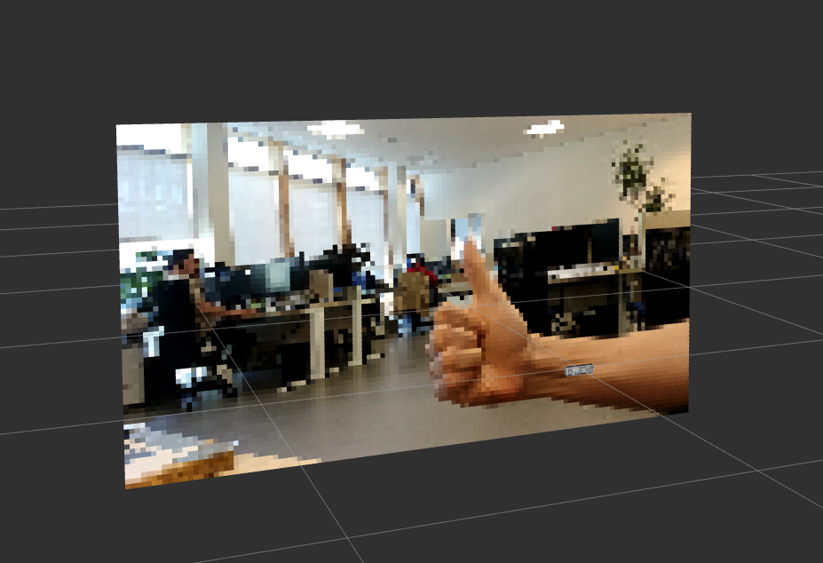

# ros2_rviz_simple_image_viewer
A simple code template in order to visualize Image msgs in the 3D viewport of rviz using point cloud.

## Usage

0. Incorporate the code to your ros2 project.
1. Replace '/your/image/topic/image_raw' with your image topic in the `image_viewer_node.py` file.
2. Replace '/your/image/as/a/pointcloud' with your desired point cloud topic in the `image_viewer_node.py` file.
3. Add the point cloud topic visualization in rviz2.
4. Done 😎

## Tested on

- ROS2 Jazzy
- Ubuntu 24.04
Should work on other distributions as well, but not tested, the code come as is without any warranty. *Might* make you save a bit of time.
